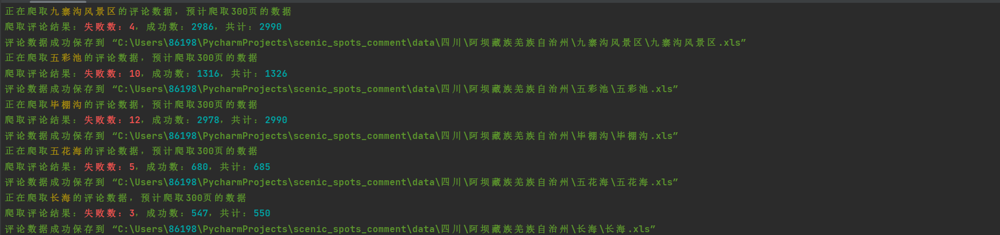
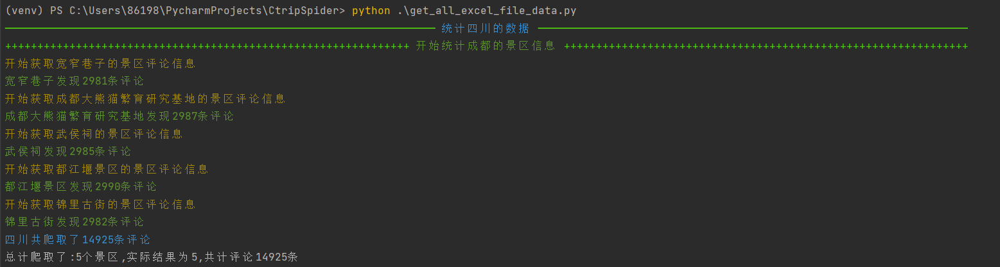

<div align="center">
    <h1 align="center">
     🛸携程热门景点评论爬虫
    </h1>
<p>该脚本仅用于爬虫技术的学习，如果你有好的功能或者想法，欢迎提交pr</p>
</div>


**具体实现过程请看**[携程热门景区评论爬取过程](https://aglorice.xlog.app/xie-cheng-re-men-jing-qu-ping-lun-pa-qu-md)
## 1️⃣实现方法

- 通过获取携程首页每个省的数据获取每个省的城市，当然如果没有你也可在`city.json`添加或者删除城市。
- 获取每个城市的热门景区
- 使用线程池爬取对应景区的评论

## 2️⃣功能支持列表

* [x] 爬取指定省份的所有城市
* [x] 获取每个城市的热门景区
* [x] 提取的评论保存为excel
* [x] 使用线程池自定义控制爬取评论速度
* [x] 支持使用代理和随机ua
* [x] ...

## 3️⃣使用方法

#### 1.克隆到本地

```bash
git clone https://github.com/aglorice/CtripSpider.git
```

#### 2.进入目录

```bash
cd CtripSpider
```

#### 3.安装依赖

```bash
pip install -r requirements.txt
```

#### 4.运行`generate_city.py`生成每个省份的城市的json文件`city.json`

```bash
python generate_city.py
```

#### 5.运行`create_file.py`根据`city.json`数据生成每个省份的城市的文件夹

```bash
python create_file.py
```

#### 6.运行`main.py`开始爬取

```bash
python main.py
```
#### 7.如果需要统计你爬的数据有多少，请运行`get_all_excel_file_data.py`

```bash
python get_all_excel_file_data.py
```

### 🐞🐞🐞经过尝试，携程是有反爬的,建议使用代理池，本项目使用[proxy_pool](https://github.com/jhao104/proxy_pool)

`config.py`

```python
# 爬取指定身份内的所有地区景点的评论数据
AREAS = ['四川']

# 爬取评论时每页的数据
PAGESIZE = 20

# 爬取评论的页数
MAX_PAGE = 300

# 是否启动代理
IS_PROXY = False

# 是否启动随机UA
IS_FAKE_USER_AGENT = False

# 是否启动验证ssl
IS_VERIFY = False

# 是否要覆盖已经保存的excel文件
IS_OVER = False

# 延时时间（城市）
CITY_SLEEP_TIME = 10

# 景区之间的休眠时间
SCENE_SLEEP_TIME = 10

# 线程池数量
POOL_NUMBER = 50

# 请求超时时间
TIME_OUT = 5


```

`city.json`

```json
{
  "city": [
    {
      "name": "四川",
      "city": [
        {
          "name": "成都",
          "url": "https://you.ctrip.com/place/chengdu104.html"
        }
      ]
    }
  ]
}
```

`scene_info.json`景区信息

```json
{
  "name": "陡坡塘瀑布",
  "url": "https://gs.ctrip.com/html5/you/sight/518/17686.html",
  "resourceId": "17686",
  "comment_total": 790,
  "comment_score": 4.6,
  "heat_score": "6.3",
  "tag_name": [
    "游山玩水"
  ],
  "poi_Level": "",
  "is_free": false
}
```
### 运行示例

#### 统计评论信息

#### excel文件


## 4️⃣注意事项

- 仓库发布的`CtripSpider`项目中涉及的任何脚本，仅用于测试和学习研究，禁止用于商业用途，不能保证其合法性，准确性，完整性和有效性，请根据情况自行判断。
- 本项目遵循MIT License协议，如果本特别声明与MIT License协议有冲突之处，以本特别声明为准。
- 以任何方式查看此项目的人或直接或间接使用`CtripSpider`项目的任何脚本的使用者都应仔细阅读此声明。`aglorice` 保留随时更改或补充此免责声明的权利。一旦使用并复制了任何相关脚本或`CtripSpider`
  项目，则视为您已接受此免责声明。

### 如果你觉得不错的话，就请我吃颗糖吧。😁😁😁


### Star History

[](https://star-history.com/#aglorice/CtripSpider&Date)
