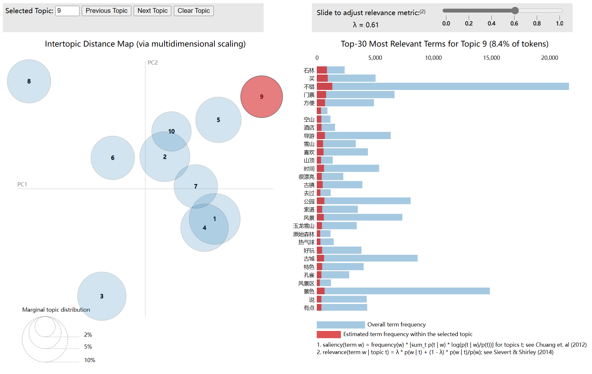
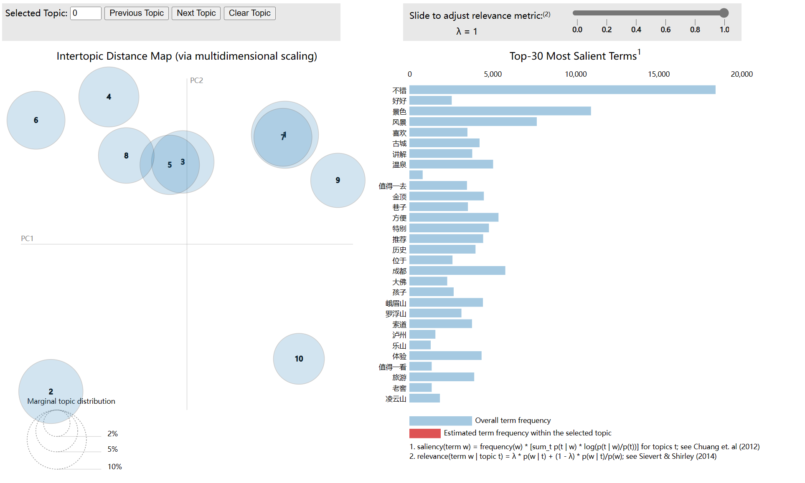
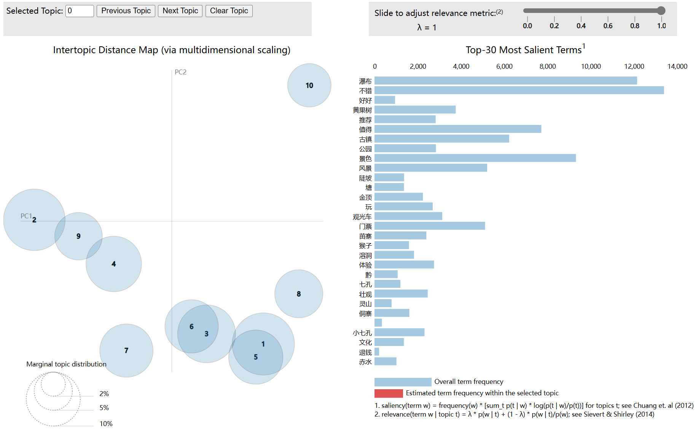

<div align="center">
    <h1 align="center">
     🛸携程热门景点评论爬取分析
    </h1>
<p>该脚本仅用于爬虫技术的学习，如果你有好的功能或者想法，欢迎提交pr</p>
</div>


### 词云图
|         云南         |             四川             |             贵州             |
|:------------------:|:--------------------------:|:--------------------------:|
|  |  |  |

### LDA主题分析


#### 云南


**主题分布**

| Topic 0       | Topic 1       | Topic 2       | Topic 3       | Topic 4       | Topic 5       | Topic 6       | Topic 7       | Topic 8       | Topic 9       |
|---------------|---------------|---------------|---------------|---------------|---------------|---------------|---------------|---------------|---------------|
| 公园: 0.0097  | 古城: 0.0101  | 不错: 0.0193  | 不错: 0.0090  | 景色: 0.0115  | 不错: 0.0252  | 景色: 0.0103  | 景色: 0.0127  | 不错: 0.0139  | 值得: 0.0143  |
| 丽江: 0.0089  | 表演: 0.0085  | 景色: 0.0125  | 买: 0.0064    | 古镇: 0.0069  | 值得: 0.0143  | 不错: 0.0075  | 不错: 0.0088  | 值得: 0.0098  | 不错: 0.0140  |
| 不错: 0.0088  | 不错: 0.0068  | 门票: 0.0073  | 石林: 0.0059  | 好好: 0.0069  | 景色: 0.0079  | 拍照: 0.0074  | 古城: 0.0071  | 感觉: 0.0063  | 景色: 0.0102  |
| 感觉: 0.0075  | 景色: 0.0060  | 泸沽湖: 0.0069 | 门票: 0.0054  | 值得: 0.0063  | 丽江: 0.0063  | 玩: 0.0057   | 洱海: 0.0069  | 风景: 0.0062  | 推荐: 0.0087  |
| 景色: 0.0071  | 民族: 0.0054  | 丽江: 0.0060  | 方便: 0.0048  | 性价比: 0.0061| 公园: 0.0062  | 门票: 0.0057  | 感觉: 0.0051  | 洱海: 0.0062  | 喜欢: 0.0086  |
| 风景: 0.0067  | 丽江: 0.0052  | 推荐: 0.0053  | 导游: 0.0047  | 湿地: 0.0059  | 方便: 0.0060  | 值得: 0.0055  | 温泉: 0.0049  | 方便: 0.0056  | 值得一去: 0.0072|
| 很美: 0.0055  | 值得: 0.0051  | 值得: 0.0048  | 公园: 0.0044  | 玩: 0.0047    | 坐: 0.0051    | 古城: 0.0054  | 玩: 0.0041   | 导游: 0.0054  | 风景: 0.0072  |
| 适合: 0.0049  | 建筑: 0.0050  | 公园: 0.0047  | 古城: 0.0042  | 漂亮: 0.0046  | 云南: 0.0048  | 很美: 0.0048  | 丽江: 0.0037 | 特别: 0.0053  | 感觉: 0.0066  |
| 古城: 0.0049  | 云南: 0.0041  | 风景: 0.0046  | 时间: 0.0042  | 导游: 0.0046  | 买: 0.0046    | 特别: 0.0047  | 腾冲: 0.0037 | 门票: 0.0045  | 公园: 0.0050  |
| 坐: 0.0045    | 公园: 0.0045  | 古城: 0.0045  | -            | 丽江: 0.0044  | 表演: 0.0042  | 体验: 0.0040  | 值得: 0.0037 | 时间: 0.0044  | 特别: 0.0047  |


#### 四川



**主题分布**

| Topic 0       | Topic 1       | Topic 2       | Topic 3       | Topic 4       | Topic 5       | Topic 6       | Topic 7       | Topic 8       | Topic 9       |
|---------------|---------------|---------------|---------------|---------------|---------------|---------------|---------------|---------------|---------------|
| 不错: 0.0156  | 不错: 0.0397  | 不错: 0.0083  | 好好: 0.0115  | 不错: 0.0084  | 景色: 0.0151  | 景色: 0.0117  | 值得: 0.0109  | 古城: 0.0063  | 不错: 0.0139  |
| 成都: 0.0066  | 风景: 0.0105  | 讲解: 0.0082  | 值得: 0.0112  | 景色: 0.0076  | 不错: 0.0080  | 喜欢: 0.0086  | 金顶: 0.0077  | 特别: 0.0061  | 风景: 0.0081  |
| 值得: 0.0061  | 值得: 0.0095  | 温泉: 0.0074  | 不错: 0.0091  | 温泉: 0.0059  | 风景: 0.0080  | 值得: 0.0048  | 景色: 0.0074  | 不错: 0.0061  | 值得: 0.0071  |
| 位于: 0.0052  | 方便: 0.0087  | 景色: 0.0073  | 景色: 0.0067  | 值得一去: 0.0054 | 值得: 0.0064  | 孩子: 0.0047  | 峨眉山: 0.0064 | 值得: 0.0052  | 特别: 0.0063  |
| 景色: 0.0049  | 推荐: 0.0079  | 古城: 0.0062  | 成都: 0.0058  | 成都: 0.0054  | 体验: 0.0058  | 感觉: 0.0042  | 索道: 0.0059  | 风景: 0.0045  | 历史: 0.0053  |
| 巷子: 0.0046  | 门票: 0.0046  | 九寨沟: 0.0058 | 巷子: 0.0052  | 风景: 0.0050  | 建议: 0.0045  | 历史: 0.0037  | 不错: 0.0056  | 游客: 0.0043  | 景色: 0.0050  |
| 历史: 0.0040  | 玩: 0.0046    | 金顶: 0.0053  | 方便: 0.0038  | 旅游: 0.0046  | 旅游: 0.0044  | 门票: 0.0035  | 推荐: 0.0044  | 吃: 0.0042    | 适合: 0.0050  |
| 时间: 0.0037  | 环境: 0.0045  | 值得一去: 0.0052 | 风景: 0.0038  | 大佛: 0.0040  | 感觉: 0.0039  | : 0.0032      | 讲解: 0.0042  | 九寨沟: 0.0042 | 很美: 0.0043  |
| 温泉: 0.0036  | 感觉: 0.0041  | 成都: 0.0050  | 特别: 0.0035  | 文化: 0.0039  | 推荐: 0.0038  | 文化: 0.0032  | 方便: 0.0041  | 体验: 0.0042  | 感觉: 0.0041  |
| 感觉: 0.0036  | 都江堰: 0.0040 | -           | 排队: 0.0035  | 历史: 0.0038  | 时间: 0.0038  | -             | -             | 美: 0.0038    | 方便: 0.0038  |


#### 贵州



**主题分布**

| Topic 0       | Topic 1       | Topic 2       | Topic 3       | Topic 4       | Topic 5       | Topic 6       | Topic 7       | Topic 8       | Topic 9       |
|---------------|---------------|---------------|---------------|---------------|---------------|---------------|---------------|---------------|---------------|
| 瀑布: 0.0188  | 不错: 0.0154  | 瀑布: 0.0218  | 不错: 0.0117  | 瀑布: 0.0104  | 景色: 0.0146  | 不错: 0.0331  | 瀑布: 0.0344  | 不错: 0.0116  | 不错: 0.0115  |
| 景色: 0.0105  | 值得: 0.0144  | 景色: 0.0095  | 景色: 0.0068  | 门票: 0.0085  | 不错: 0.0096  | 值得: 0.0149  | 古镇: 0.0095  | 风景: 0.0105  | 景色: 0.0108  |
| 风景: 0.0088  | 古镇: 0.0085  | 黄果树: 0.0088 | 门票: 0.0060  | 景色: 0.0082  | 好好: 0.0093  | 景色: 0.0101  | 黄果树: 0.0085 | 古镇: 0.0102  | 感觉: 0.0064  |
| 不错: 0.0074  | 推荐: 0.0079  | 不错: 0.0086  | 风景: 0.0059  | 观光车: 0.0070| 古镇: 0.0067  | 门票: 0.0079  | 值得: 0.0076  | 景色: 0.0084  | 值得: 0.0061  |
| 黄果树: 0.0072| 体验: 0.0070  | 推荐: 0.0071  | 瀑布: 0.0059  | 不错: 0.0070  | 公园: 0.0063  | 古镇: 0.0069  | 特别: 0.0074  | 值得: 0.0068  | 门票: 0.0060  |
| 漂亮: 0.0059  | 景色: 0.0065  | 玩: 0.0069   | 值得: 0.0056  | 坐: 0.0060    | 瀑布: 0.0043  | 感觉: 0.0061  | 景色: 0.0070  | 公园: 0.0059  | 观光车: 0.0058|
| 排队: 0.0044  | 方便: 0.0049  | 值得: 0.0059  | 买: 0.0050    | 感觉: 0.0053  | 游玩: 0.0043  | 方便: 0.0059  | 风景: 0.0060  | 时间: 0.0050  | 古镇: 0.0058  |
| 时间: 0.0044  | 苗寨: 0.0044  | 门票: 0.0055  | 建议: 0.0046  | 贵州: 0.0048  | 游客: 0.0040  | 贵州: 0.0044  | 陡坡: 0.0051  | 金顶: 0.0048  | 瀑布: 0.0055  |
| 服务: 0.0041  | 时间: 0.0041  | 贵州: 0.0050  | 值得一去: 0.0044| 洞: 0.0046   | 猴子: 0.0038  | 公园: 0.0041  | 塘: 0.0045   | 天气: 0.0039  | 风景: 0.0053  |
| 苗寨: 0.0039  | 溶洞: 0.0041  | 古镇: 0.0049  | 游客: 0.0042  | 值得: 0.0044  | 黔: 0.0037   | 侗寨: 0.0040  | -            | 排队: 0.0035  | 方便: 0.0046  |


### 爬虫实现
**具体实现过程请看**[携程热门景区评论爬取过程](https://aglorice.xlog.app/xie-cheng-re-men-jing-qu-ping-lun-pa-qu-md)
## 1️⃣实现方法

- 通过获取携程首页每个省的数据获取每个省的城市，当然如果没有你也可在`city.json`添加或者删除城市。
- 获取每个城市的热门景区
- 使用线程池爬取对应景区的评论

## 2️⃣功能支持列表

* [x] 爬取指定省份的所有城市
* [x] 获取每个城市的热门景区
* [x] 提取的评论保存为excel
* [x] 使用线程池自定义控制爬取评论速度
* [x] 支持使用代理和随机ua
* [x] ...

## 3️⃣使用方法

#### 1.克隆到本地

```bash
git clone https://github.com/aglorice/CtripSpider.git
```

#### 2.进入目录

```bash
cd CtripSpider
```

#### 3.安装依赖

```bash
pip install -r requirements.txt
```

#### 4.运行`generate_city.py`生成每个省份的城市的json文件`city.json`

```bash
python generate_city.py
```

#### 5.运行`create_file.py`根据`city.json`数据生成每个省份的城市的文件夹

```bash
python create_file.py
```

#### 6.运行`main.py`开始爬取

```bash
python main.py
```
#### 7.如果需要统计你爬的数据有多少，请运行`get_all_excel_file_data.py`

```bash
python get_all_excel_file_data.py
```

### 🐞🐞🐞经过尝试，携程是有反爬的,建议使用代理池，本项目使用[proxy_pool](https://github.com/jhao104/proxy_pool)

`config.py`

```python
# 爬取指定省份内的所有地区景点的评论数据
AREAS = ['四川']

# 爬取评论时每页的数据
PAGESIZE = 20

# 爬取评论的页数
MAX_PAGE = 300

# 是否启动代理
IS_PROXY = False

# 是否启动随机UA
IS_FAKE_USER_AGENT = False

# 是否启动验证ssl
IS_VERIFY = False

# 是否要覆盖已经保存的excel文件
IS_OVER = False

# 延时时间（城市）
CITY_SLEEP_TIME = 10

# 景区之间的休眠时间
SCENE_SLEEP_TIME = 10

# 线程池数量
POOL_NUMBER = 50

# 请求超时时间
TIME_OUT = 5


```

`city.json`
> 如果运行`generate_city.py` 没有获取到你需要的城市，你也可以选择手动添加,只需要符合格式即可。

```json
{
  "city": [
    {
      "name": "四川",
      "city": [
        {
          "name": "成都",
          "url": "https://you.ctrip.com/place/chengdu104.html"
        }
      ]
    }
  ]
}
```

`scene_info.json`景区信息

```json
{
  "name": "陡坡塘瀑布",
  "url": "https://gs.ctrip.com/html5/you/sight/518/17686.html",
  "resourceId": "17686",
  "comment_total": 790,
  "comment_score": 4.6,
  "heat_score": "6.3",
  "tag_name": [
    "游山玩水"
  ],
  "poi_Level": "",
  "is_free": false
}
```
### 运行示例

#### 统计评论信息

#### excel文件


## 4️⃣注意事项

- 仓库发布的`CtripSpider`项目中涉及的任何脚本，仅用于测试和学习研究，禁止用于商业用途，不能保证其合法性，准确性，完整性和有效性，请根据情况自行判断。
- 本项目遵循MIT License协议，如果本特别声明与MIT License协议有冲突之处，以本特别声明为准。
- 以任何方式查看此项目的人或直接或间接使用`CtripSpider`项目的任何脚本的使用者都应仔细阅读此声明。`aglorice` 保留随时更改或补充此免责声明的权利。一旦使用并复制了任何相关脚本或`CtripSpider`
  项目，则视为您已接受此免责声明。


### Star History

[](https://star-history.com/#aglorice/CtripSpider&Date)
